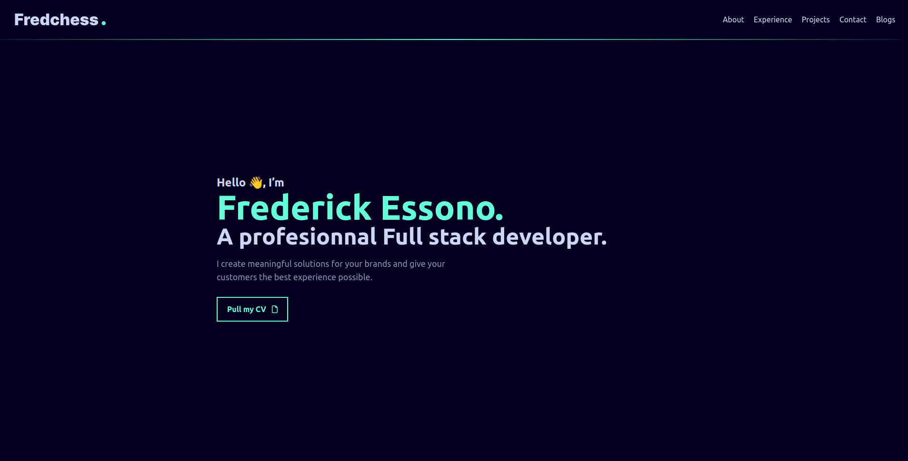

<div align="center">
  
</div>
<h1 align="center">
  fredchess.com
</h1>
<p align='center'>
this is the first draft of my personal portfolio that I do. It was done using <a href="https://vuejs.org/">vue.js</a>, <a href="https://tailwindcss.com/">Tailwind Css</a> and  <a href="https://vitejs.dev/">Vite</a>.
</p>



## Tools used

1. **Adobe After Effect + Lottie** for the startup animation

2. **Slider** for slides

3. **AOS** for animations

4. **Font Awesome** for Icons

## Installation steps

1. Install all dependencies

``` sh 
npm install
```
2. Run app locally

``` sh 
npm run dev
```

3. Build for deployment

``` sh 
npm run build
```

## Copyrigth informations

This is open an open source project, you can fork it but make sure to give me a credit by linking back to [fredchess.com](https://fredchess.com). 

I am happy to share this with you, but I will be even more so seeing that I am crediting for the work I have done.

## Buy me a coffee

This project is the result of an hardwork but I've decided to share it. So if you want to support me, you can do so via [My ko-fi link](https://ko-fi.com/s/36be94f8cf) and retrieve the original Figma file that helped me complete this work.